# Struktura Folderów

Wizualizacja organizacji plików i folderów w projekcie.

```mermaid
graph TD
    ROOT["📁 odczarujpowerbi"]

    ROOT --> RESOURCES["📁 100. RESOURCES<br/>CSS + JS Templates"]
    ROOT --> INPUTS["📁 300. INPUTS<br/>Markdown Sources"]
    ROOT --> OUTPUTS["📁 400. OUTPUTS<br/>Generated HTML"]
    ROOT --> PYTHON["🐍 Python Scripts"]
    ROOT --> CONFIG["⚙️ config.md"]

    INPUTS --> TRAINING1["📁 2025-12 Poziom Podstawowy"]
    TRAINING1 --> MODULE1["📁 00 - 02 Podstawy"]
    TRAINING1 --> MODULE2["📁 03 - 06 Kontekst"]

    MODULE1 --> T1["📝 00. Konfiguracja.md"]
    MODULE1 --> T2["📝 01. Podstawy DAX.md"]
    MODULE1 --> Q1["❓ 01a. Quiz.md"]
    MODULE1 --> G1["✏️ 01a. Gaps.md"]

    OUTPUTS --> TRAINING1_OUT["📁 2025-12 Poziom Podstawowy"]
    TRAINING1_OUT --> MODULE1_OUT["📁 00 - 02 Podstawy"]
    MODULE1_OUT --> H1["📄 Multiple HTML files"]

    OUTPUTS --> MEASURES["📁 _Measures"]
    MEASURES --> TMDL["📋 _HTML.md"]
    MEASURES --> PARAM["📊 _Parametr.md"]

    PYTHON --> MAIN["🎯 main.py"]
    PYTHON --> UTILS["🔧 utils.py"]
    PYTHON --> TEXT["📄 text_utils.py"]
    PYTHON --> TEORIA["📚 theory_processor.py"]
    PYTHON --> QUIZ["❓ quiz_processor.py"]
    PYTHON --> GAPS["✏️ gaps_processor.py"]
    PYTHON --> TEMPLATE["🎨 template_loader.py"]

    classDef folderStyle fill:#fff3cd,stroke:#856404,stroke-width:2px
    classDef fileStyle fill:#d1ecf1,stroke:#0c5460,stroke-width:2px
    classDef scriptStyle fill:#d4edda,stroke:#155724,stroke-width:2px

    class ROOT,RESOURCES,INPUTS,OUTPUTS,TRAINING1,MODULE1,MODULE2,TRAINING1_OUT,MODULE1_OUT,MEASURES,PYTHON folderStyle
    class T1,T2,Q1,G1,H1,TMDL,PARAM,CONFIG fileStyle
    class MAIN,UTILS,TEXT,TEORIA,QUIZ,GAPS,TEMPLATE scriptStyle
```



## Opis

### Struktura folderów głównych:

**100. RESOURCES**
- Szablony CSS i JavaScript dla każdego typu treści
- Pliki w formacie Markdown z embedded CSS/JS

**300. INPUTS**
- Źródłowe pliki Markdown z treściami szkoleniowymi
- Organizacja hierarchiczna: Szkolenie → Moduł → Pliki
- Trzy typy plików: teoria, quiz, gaps

**400. OUTPUTS**
- Wygenerowane pliki HTML (miary Power BI)
- Struktura lustrzana do 300. INPUTS
- Specjalny folder `_Measures` z TMDL

**Python Scripts (root)**
- 7 modułów: orchestrator + utilities + 3 procesory + loader

**config.md**
- Konfiguracja mapowania CSS/JS
- Ustawienia typografii
- Opcje generowania

### Przepływ danych przez foldery:

```
100. RESOURCES → [Python] → 300. INPUTS → [Processing] → 400. OUTPUTS → Power BI
                      ↑
                  config.md
```
