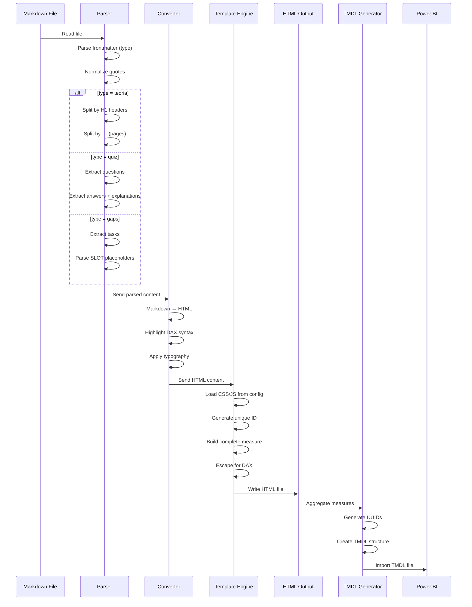

# Kluczowe Transformacje

Diagram sekwencji pokazujący krok po kroku jak plik Markdown staje się miarą w Power BI.

## Opis sekwencji

### 1. Parser Stage (Etap parsowania)
**Input**: Plik Markdown z frontmatter

Akcje:
- Wczytanie pliku z dysku
- Parsowanie frontmatter YAML (wyciąganie `type: teoria/quiz/gaps`)
- Normalizacja cudzysłowów (typograficzne → ASCII)

Rozgałęzienie według typu:
- **teoria**: Split według H1, następnie split według `---` (strony)
- **quiz**: Ekstrakcja pytań i odpowiedzi
- **gaps**: Ekstrakcja zadań i SLOT placeholders

### 2. Converter Stage (Etap konwersji)
**Input**: Sparsowana treść (text chunks)

Akcje:
- Konwersja Markdown → HTML (bold, italic, lists, code blocks)
- Podświetlanie składni DAX (keywords, functions, numbers, comments)
- Aplikacja typografii (polskie cudzysłowy, znaki specjalne)

### 3. Template Engine Stage (Etap szablonowania)
**Input**: HTML content

Akcje:
- Wczytanie CSS/JS z config.md (mapowanie według typu)
- Generowanie unikalnego ID (MD5 hash z tytułu sekcji)
- Budowanie kompletnej miary HTML z nawigacją/interaktywnością
- Escape znaków specjalnych dla DAX (quotes → apostrophes)

### 4. Output Stage (Etap zapisu)
**Input**: Gotowa miara HTML

Akcje:
- Zapis pliku HTML do 400. OUTPUTS (zachowanie struktury katalogów)

### 5. TMDL Generation Stage (Etap generowania TMDL)
**Input**: Wszystkie wygenerowane pliki HTML

Akcje:
- Agregacja wszystkich miar do jednej tabeli `_HTML`
- Generowanie UUID dla lineage tags
- Utworzenie struktury TMDL (table + measures + partition)
- Zapis do `_HTML.md` i `_Parametr.md`

### 6. Power BI Import
**Input**: TMDL file (`_HTML.md`)

Akcja:
- Import TMDL do Power BI Desktop
- Wszystkie miary HTML gotowe do użycia w wizualizacjach
