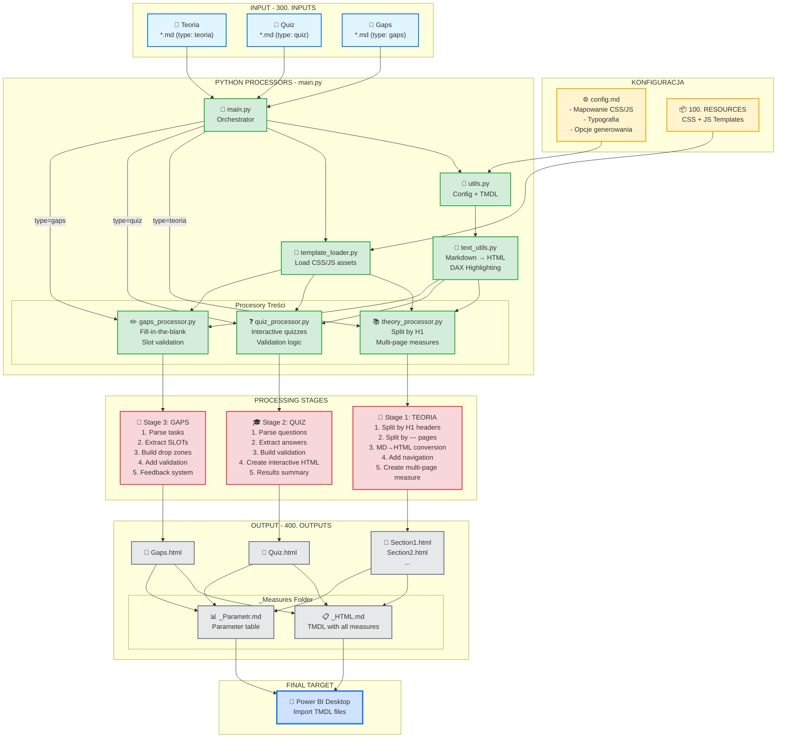

# Diagram Przepływu Danych

Główny diagram pokazujący całą architekturę projektu od inputów przez procesory do outputów i Power BI.

## Opis

Ten diagram przedstawia kompletny ekosystem projektu:

- **INPUT**: Trzy typy plików Markdown (teoria, quiz, gaps) z folderu 300. INPUTS
- **KONFIGURACJA**: config.md steruje mapowaniem CSS/JS, a folder 100. RESOURCES zawiera szablony
- **PROCESORY**: 7 modułów Python współpracujących ze sobą
- **ETAPY**: Trzy specjalizowane ścieżki przetwarzania dla różnych typów treści
- **OUTPUT**: Wygenerowane pliki HTML + TMDL gotowe do importu do Power BI
