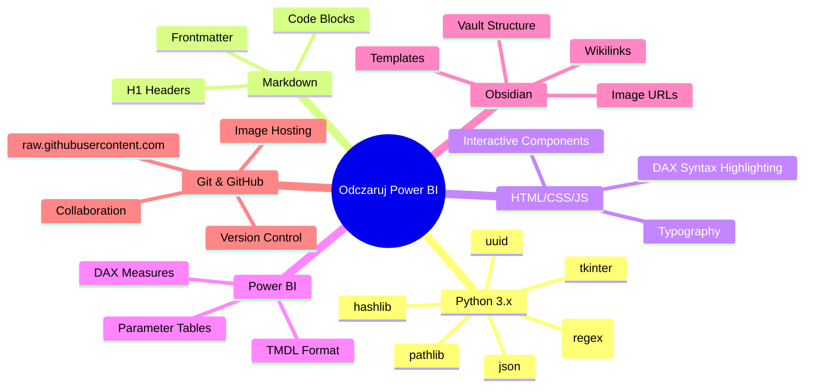

# Stack Technologiczny

Mapa myśli przedstawiająca wszystkie technologie i biblioteki użyte w projekcie.

## Opis

### Python 3.x
Backend projektu napisany w Pythonie z wykorzystaniem:
- **pathlib**: Zarządzanie ścieżkami do plików
- **re (regex)**: Parsowanie i transformacja tekstu (DAX highlighting, quotes normalization)
- **json**: Wczytywanie konfiguracji z config.md
- **tkinter**: Wyświetlanie powiadomień GUI o sukcesie/błędzie
- **hashlib**: Generowanie unikalnych ID dla funkcji JavaScript (MD5)
- **uuid**: Generowanie lineage tags dla TMDL

### Markdown
Format źródłowy treści:
- **Frontmatter**: Metadane (type: teoria/quiz/gaps)
- **H1 Headers**: Struktura sekcji w teoria
- **Code Blocks**: Bloki kodu DAX do podświetlania

### HTML/CSS/JS
Warstwa prezentacji:
- **Interactive Components**: Nawigacja, przyciski, drop zones
- **DAX Syntax Highlighting**: Kolorowanie składni DAX w HTML
- **Typography**: Polskie cudzysłowy i typografia

### Power BI
Platforma docelowa:
- **TMDL Format**: Tabular Model Definition Language dla importu
- **DAX Measures**: Miary zawierające HTML
- **Parameter Tables**: Tabela parametrów z metadanymi

### Obsidian
Środowisko tworzenia:
- **Vault Structure**: Organizacja folderów 300. INPUTS
- **Image URLs**: Automatyczne linki do GitHub
- **Wikilinks**: Konwersja `![[image.png]]` na URL
- **Templates**: Szablony treści (Alt+Shift+1)

### Git & GitHub
Kontrola wersji i hosting:
- **Version Control**: Śledzenie zmian w projekcie
- **Image Hosting**: GitHub jako CDN dla obrazków
- **raw.githubusercontent.com**: Hosting GIF-ów dla Power BI
- **Collaboration**: Współpraca nad treściami szkoleniowymi
