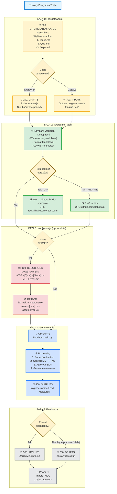

# Workflow Tworzenia Treści - Diagram

Diagram przedstawiający kompletny proces od pomysłu do gotowych miar Power BI.

```mermaid
flowchart TD
    START["💡 Nowy Pomysł na Treść"]

    subgraph "FAZA 1: Przygotowanie"
        TEMPLATE["📋 000. UTILITIES/TEMPLATES<br/>Alt+Shift+1<br/>Wybierz szablon:<br/>- 1. Teoria.md<br/>- 2. Quiz.md<br/>- 3. Gaps.md"]
        DECISION1{"Gdzie<br/>pracujemy?"}
        DRAFTS["📝 200. DRAFTS<br/>Robocza wersja<br/>Nieukończone projekty"]
        INPUTS["✅ 300. INPUTS<br/>Gotowe do generowania<br/>Finalna treść"]
    end

    subgraph "FAZA 2: Tworzenie Treści"
        EDIT["✏️ Edycja w Obsidian<br/>- Dodaj treść<br/>- Wstaw obrazy (wikilinks)<br/>- Format Markdown<br/>- Używaj frontmatter"]
        IMAGES{"Potrzebujesz<br/>obrazów?"}
        GIF["🖼️ GIF → bin/grafiki-do-szkolenia/<br/>URL: raw.githubusercontent.com"]
        PNG["🖼️ PNG → bin/<br/>URL: github.com/blob/main"]
    end

    subgraph "FAZA 3: Konfiguracja (opcjonalnie)"
        NEED_CSS{"Nowy<br/>CSS/JS?"}
        ADD_RESOURCE["📦 100. RESOURCES<br/>Dodaj nowy plik:<br/>- CSS - [Type] - [Name].md<br/>- JS - [Type].md"]
        UPDATE_CONFIG["⚙️ config.md<br/>Zaktualizuj mapowanie:<br/>assets.[type].css<br/>assets.[type].js"]
    end

    subgraph "FAZA 4: Generowanie"
        GENERATE["🚀 Alt+Shift+2<br/>Uruchom main.py"]
        PROCESSING["⚙️ Processing<br/>1. Parse frontmatter<br/>2. Convert MD→HTML<br/>3. Apply CSS/JS<br/>4. Generate measures"]
        OUTPUT["📄 400. OUTPUTS<br/>Wygenerowane HTML<br/>+ _Measures/"]
    end

    subgraph "FAZA 5: Finalizacja"
        CHECK{"Projekt<br/>ukończony?"}
        ARCHIVE["📦 500. ARCHIVE<br/>Zarchiwizuj projekt"]
        KEEP_DRAFT["📝 200. DRAFTS<br/>Zostaw jako draft"]
        PBI["💼 Power BI<br/>Import TMDL<br/>Użyj w raportach"]
    end

    START --> TEMPLATE
    TEMPLATE --> DECISION1

    DECISION1 -->|"Draft/WIP"| DRAFTS
    DECISION1 -->|"Gotowe"| INPUTS

    DRAFTS --> EDIT
    INPUTS --> EDIT

    EDIT --> IMAGES
    IMAGES -->|"Tak - GIF"| GIF
    IMAGES -->|"Tak - PNG/inne"| PNG
    IMAGES -->|"Nie"| NEED_CSS

    GIF --> NEED_CSS
    PNG --> NEED_CSS

    NEED_CSS -->|"Tak"| ADD_RESOURCE
    ADD_RESOURCE --> UPDATE_CONFIG
    UPDATE_CONFIG --> GENERATE

    NEED_CSS -->|"Nie"| GENERATE

    GENERATE --> PROCESSING
    PROCESSING --> OUTPUT

    OUTPUT --> CHECK

    CHECK -->|"Tak"| ARCHIVE
    CHECK -->|"Nie, będę pracować dalej"| KEEP_DRAFT

    ARCHIVE --> PBI
    KEEP_DRAFT --> PBI

    %% Styling
    classDef startClass fill:#e1f5ff,stroke:#0078d4,stroke-width:3px
    classDef templateClass fill:#fff4ce,stroke:#f4a300,stroke-width:2px
    classDef editClass fill:#d4edda,stroke:#28a745,stroke-width:2px
    classDef configClass fill:#f8d7da,stroke:#dc3545,stroke-width:2px
    classDef generateClass fill:#cfe2ff,stroke:#0d6efd,stroke-width:2px
    classDef finalClass fill:#e7e8ea,stroke:#6c757d,stroke-width:2px
    classDef decisionClass fill:#fff3cd,stroke:#856404,stroke-width:2px

    class START startClass
    class TEMPLATE,DRAFTS,INPUTS templateClass
    class EDIT,GIF,PNG editClass
    class ADD_RESOURCE,UPDATE_CONFIG configClass
    class GENERATE,PROCESSING,OUTPUT generateClass
    class ARCHIVE,KEEP_DRAFT,PBI finalClass
    class DECISION1,IMAGES,NEED_CSS,CHECK decisionClass
```

